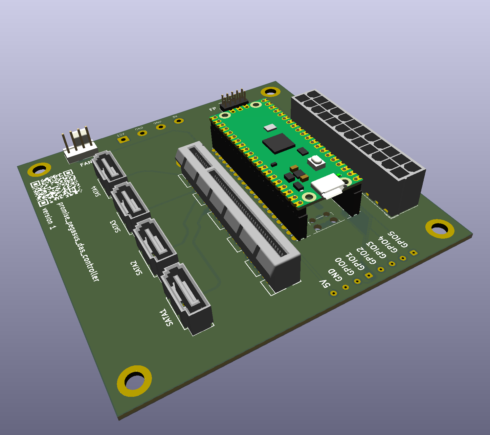

# Promise Pegasus DAS controller

The Promise Pegasus DAS is a thuderbolt 2 DAS enclosure.

The goal here is to reverse engineer the backplane and replace the RAID controller with a SATA breakout board and microcontroller.

# Current Status
## reverse engineering
The reverse engineering of the backplane is done, for now described in [docs/backplane.md](docs/backplane.md).

## v0
The first PCB version is not present on the repo. The pinout for both the PCI connector and the ATX24 connector was completely wrong.
Is seems in the debugging process I damaged the CPLD controlling the LEDs, which is why v2 will add a ws2812 control pin.

## v1

This is the current version on the PCB. Pinouts are correct: 
- ✅ the pico is always on
- ✅ the front panel interfaces to the pico
- ✅ pico triggers the PSU
- ✅ CPLD control pins arrive where they should
- ✅ Disk power enable pins work
- ✅ sata works (tested with HDD1 only)
- ❌ ground fill missing, bodge wires were needed.

## v2 (TODO)
- add ws2812 control pin to pico
- add ground fill to the PCB
- add onboard temperature sensor

# BOM:
- SATA: https://www.mouser.ch/ProductDetail/Adam-Tech/SATA-A-PL-VT-K-1
- PCI: https://www.mouser.ch/ProductDetail/Amphenol-FCI/10018783-10212TLF
- ATX24pin: https://www.mouser.fr/ProductDetail/TE-Connectivity/1-1775099-3?qs=28ld6GkVMjRzvehyCXdQkg%3D%3D

pio simulator: https://ice458.github.io/tools/pio_sim/index.html