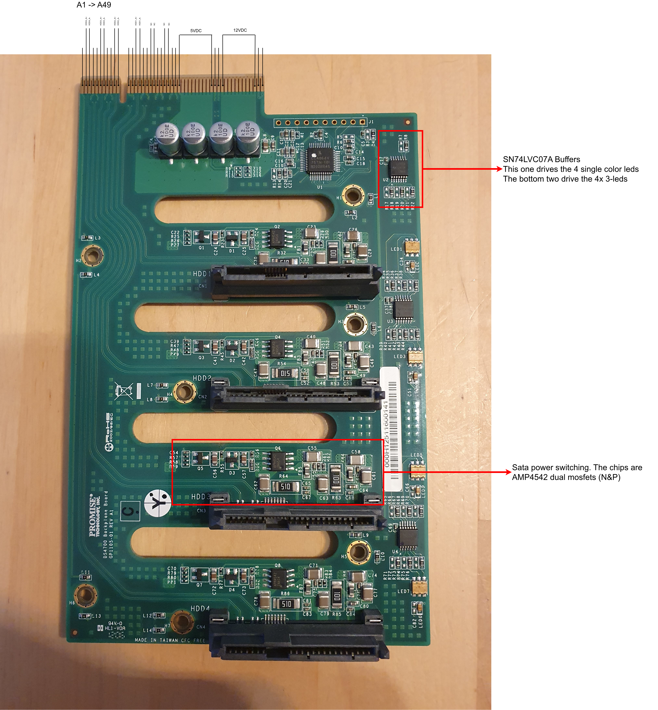
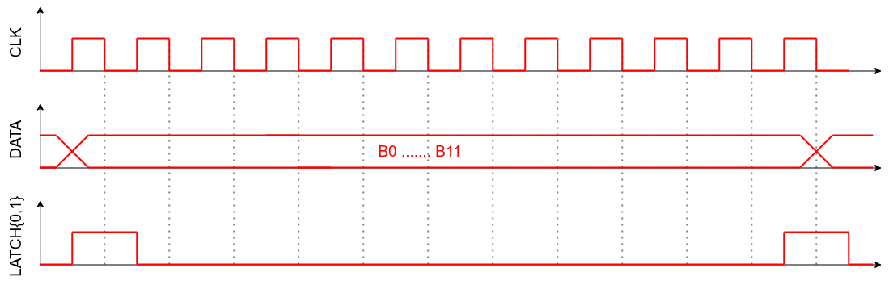

# Backplate
## Hardware

The backplane is connected to the controller by it's edge into a PCIe x8 connector.

| [Front](backplane_pinout-front.png) | [Back](backplane_pinout-back.png) |
|-|- |
|  |  |

Its' fonctionalities:
- route 12V and 5V to the disks
- pairs of disks can be powered on/off using `ENABLE_HDD12` and `ENABLE_HDD34` pins

- each disk has a blue activity led and a RGB (orange+blue+red) status led so that's 16 leds in total. These are controlled by the CPLD on the backplane. 
- The CPLD is controlled with a special seral protocol on `LED_CLK`, `LED_DATA`, `LED_LATCH_0` and `LED_LATCH_1` pins.
- The procol is based on 12bit frames send over the DATA line at 62.5kHz. Latch signals are set high between each frame: 
- Bits are goupped by 3 for each of the 4 drive slots. The MSB of the group is the blue activity led, and the 2 LSBs are for the status led:
    |b2|b1|b0|result|
    |-|-|-|-|
    |0|x|x|activity off|
    |1|x|x|activity on|
    |x|0|0|status blue|
    |x|0|1|status red|
    |x|1|0|status orange|
    |x|1|1|status off|

- SATA pairs are directly routed to the connector.

